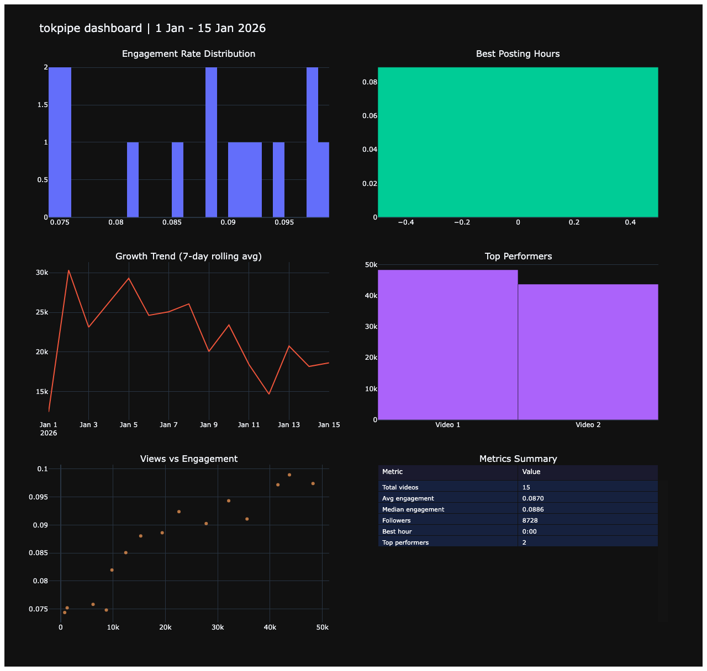

# tokpipe

[](https://www.python.org/downloads/)
[](LICENSE)
[](https://github.com/aroaxinping/tokpipe/actions/workflows/ci.yml)

Data pipeline for TikTok analytics. Import your exported data, clean it, classify content, compute real metrics, and visualize what actually works.

No APIs, no scraping, no third-party tokens. Just your TikTok export files (CSV/XLSX) and Python.

---

## Why tokpipe?

TikTok gives you a spreadsheet with raw numbers. That's it. No insights, no trends, no "why did this video work?".

tokpipe takes that file and builds a full analytics pipeline: cleans the data, classifies your content by topic, computes real metrics (engagement rate, best posting hour, growth trends), and generates an interactive dashboard, an Excel report with formulas, and static charts. One command, all outputs.

It's built for creators who want to understand their data without depending on third-party tools that ask for your credentials.

---

## What you get

```bash
tokpipe analyze TikTok_Analytics.xlsx --followers 8728
```

| Output | What it is |
|---|---|
| `report.csv` | Your data cleaned + engagement rate, completion rate, category per video |
| `analytics.xlsx` | Excel with native formulas — open in Excel or Google Sheets |
| `dashboard.html` | Interactive Plotly dashboard — open in any browser, hover for details |
| `engagement.png` | Engagement rate distribution across all your videos |
| `best_hours.png` | Which hours get the best engagement |
| `growth.png` | 7-day rolling average of your views |

### Dashboard preview



---

## Architecture

```
tokpipe follows a classic ETL pipeline structure:

  Export (TikTok XLSX/CSV)
        |
        v
  +-----------+
  |  ingest   |  --> Load and validate raw export files
  +-----------+
        |
        v
  +-----------+
  |  clean    |  --> Normalize columns, fix types, handle nulls
  +-----------+
        |
        v
  +-----------+
  | classify  |  --> Tag each video with a topic/category
  +-----------+
        |
        v
  +-----------+
  |  metrics  |  --> Compute engagement rate, retention, trends
  +-----------+
        |
        v
  +-----------+    +-----------+    +-----------+
  |  output   |    |   excel   |    | dashboard |
  | (CSV/PNG) |    |  (.xlsx)  |    |  (.html)  |
  +-----------+    +-----------+    +-----------+
```

### Modules

| Module | What it does |
|---|---|
| `tokpipe.ingest` | Reads TikTok export files (XLSX, CSV). Detects format, validates columns, returns a raw DataFrame. |
| `tokpipe.clean` | Normalizes column names, converts date/number types, drops corrupted rows, fills missing values. |
| `tokpipe.classify` | Assigns a topic/category to each video. Configurable via YAML rules or custom function. |
| `tokpipe.metrics` | Computes derived metrics: engagement rate, average watch time, best posting hour, growth trends. |
| `tokpipe.output` | Exports results to CSV/JSON. Generates matplotlib/seaborn PNG charts. |
| `tokpipe.excel` | Generates Excel report with native formulas, formatting, and embedded charts. |
| `tokpipe.dashboard` | Generates interactive Plotly HTML dashboard with all visualizations. |
| `tokpipe.cli` | Command-line interface. Entry point for `tokpipe analyze`. |

---

## Prerequisites

You need two things before installing tokpipe:

### Python 3.10+

Check your version:

```bash
python --version
# or
python3 --version
```

If you don't have it:

```bash
# macOS (Homebrew)
brew install python

# Ubuntu/Debian
sudo apt install python3 python3-venv python3-pip

# Windows (winget)
winget install Python.Python.3.12
```

Or download directly from [python.org](https://www.python.org/downloads/).

### git (optional)

Only needed to clone the repo. You can also [download the ZIP](https://github.com/aroaxinping/tokpipe/archive/refs/heads/main.zip) from GitHub.

```bash
git --version
```

---

## Get your TikTok data

tokpipe works with the analytics files that TikTok lets you export. No API keys, no scraping — just the file TikTok gives you.

**How to export:**

1. Open TikTok on **desktop** (not the app) or go to [tiktok.com](https://www.tiktok.com)
2. Go to your profile > **Creator tools** > **Analytics**
3. Select the date range you want to analyze
4. Click **Export data** (top right)
5. Download the XLSX or CSV file

**What the file should contain:**

| Required columns | Optional columns |
|---|---|
| Views | Watch time |
| Likes | Video duration |
| Comments | Post date/time |
| Shares | Caption/description |

tokpipe auto-detects column names in both English and Spanish. If your export uses different names, the pipeline will try to match them — if it can't find a `views` column, it will tell you.

---

## Installation

```bash
# Clone the repo
git clone https://github.com/aroaxinping/tokpipe.git
cd tokpipe

# Create a virtual environment
python3 -m venv .venv

# Activate it
source .venv/bin/activate        # macOS / Linux
# .venv\Scripts\activate         # Windows (cmd)
# .venv\Scripts\Activate.ps1     # Windows (PowerShell)

# Install tokpipe and all its dependencies
pip install -e .
```

This installs: pandas, openpyxl, matplotlib, seaborn, plotly, and pyyaml.

Verify it worked:

```bash
tokpipe --version
# tokpipe 0.1.0
```

---

## Usage

### Try it with sample data

Don't have a TikTok export yet? Use the included sample:

```bash
tokpipe analyze examples/sample_data.csv --output sample_results/
```

### Quick start

```bash
# Make sure your venv is active
source .venv/bin/activate

# Run the pipeline on your export file
tokpipe analyze ~/Downloads/TikTok_Analytics.xlsx
```

That's it. It will create a `results/` folder with everything.

### Output files

```
results/
  report.csv           # Your data cleaned + engagement rate, completion rate, category
  analytics.xlsx       # Excel with native formulas (open in Excel/Google Sheets)
  dashboard.html       # Interactive dashboard (open in any browser)
  engagement.png       # Engagement rate distribution chart
  best_hours.png       # Which hours get the best engagement
  growth.png           # How your views are trending over time
```

### All CLI options

```bash
tokpipe analyze <file> [options]
```

| Option | What it does | Example |
|---|---|---|
| `--output`, `-o` | Output directory (default: `results/`) | `--output my_report/` |
| `--followers` | Your follower count (shown in reports) | `--followers 8728` |
| `--period` | Label for the date range you're analyzing | `--period "24 Feb - 23 Mar 2026"` |
| `--rules` | Path to YAML file with custom classification rules | `--rules my_rules.yaml` |
| `--no-charts` | Skip PNG chart generation | |
| `--no-dashboard` | Skip HTML dashboard generation | |
| `--no-excel` | Skip Excel report generation | |

### Full example

```bash
tokpipe analyze TikTok_Analytics.xlsx \
  --output results/ \
  --followers 8728 \
  --period "24 Feb - 23 Mar 2026" \
  --rules rules.yaml
```

### Only want the CSV?

```bash
tokpipe analyze data.xlsx --no-dashboard --no-excel --no-charts
```

### Python API

```python
from tokpipe import ingest, clean, classify, metrics, output, excel, dashboard

# Load and clean
raw = ingest.load("TikTok_Analytics.xlsx")
df = clean.normalize(raw)

# Classify content
df["category"] = classify.classify(df)

# Compute metrics
report = metrics.compute(df)
print(report.summary())

# Export
output.to_csv(report, "report.csv")
excel.to_excel(report, "analytics.xlsx", followers=8728)
dashboard.generate(report, "dashboard.html")
```

---

## Content classification

By default, tokpipe classifies videos into: setup, coding, data, study, tech, other.

### Custom rules via YAML

Create a `rules.yaml`:

```yaml
setup:
  - keyboard
  - monitor
  - desk
  - compra
coding:
  - python
  - debug
  - script
data:
  - dataset
  - pandas
  - sql
study:
  - exam
  - uni
  - homework
```

```bash
tokpipe analyze data.xlsx --rules rules.yaml
```

### Custom function (Python API)

```python
def my_classifier(text: str) -> str:
    if "python" in text:
        return "coding"
    if "setup" in text:
        return "setup"
    return "other"

df["category"] = classify.classify(df, classifier_fn=my_classifier)
```

---

## SQL queries

The `sql/` directory contains reference queries for analyzing your exported CSV with DuckDB, SQLite, or any SQL engine:

```bash
# Example with DuckDB
duckdb -c "
  CREATE TABLE videos AS SELECT * FROM read_csv_auto('results/report.csv');
  SELECT * FROM videos ORDER BY engagement_rate DESC LIMIT 10;
"
```

See [sql/queries.sql](sql/queries.sql) for the full set.

---

## Available metrics

| Metric | Formula / Description |
|---|---|
| Engagement rate | (likes + comments + shares) / views |
| Average watch time | Total watch time / views |
| Completion rate | Average watch time / video duration |
| Best posting hour | Hour with highest median engagement |
| Growth trend | Rolling 7-day average of views |
| Top performers | Videos above 90th percentile engagement |

---

## Project structure

```
tokpipe/
  .github/
    workflows/
      ci.yml              # GitHub Actions CI (tests on Python 3.10-3.13)
    ISSUE_TEMPLATE/
      bug_report.md       # Bug report template
      feature_request.md  # Feature request template
  src/
    tokpipe/
      __init__.py         # Package init, version
      cli.py              # Command-line interface
      ingest.py           # Load TikTok exports
      clean.py            # Normalize and clean data
      classify.py         # Content classifier (YAML / custom function)
      metrics.py          # Compute derived metrics
      output.py           # CSV/JSON export + matplotlib charts
      excel.py            # Excel report with formulas
      dashboard.py        # Interactive Plotly HTML dashboard
  tests/
    test_ingest.py
    test_clean.py
    test_metrics.py
  sql/
    queries.sql           # Reference SQL queries
  examples/
    basic_analysis.py     # Minimal working example
    sample_data.csv       # Fake data to test without a TikTok account
  pyproject.toml
  LICENSE
  CONTRIBUTING.md
  README.md
```

---

## Troubleshooting

### `ModuleNotFoundError: No module named 'tokpipe'`

Your virtual environment is not activated. Run:

```bash
source .venv/bin/activate        # macOS / Linux
.venv\Scripts\activate           # Windows
```

### `ModuleNotFoundError: No module named 'pandas'`

Dependencies are not installed. Run:

```bash
pip install -e .
```

### `ValueError: Could not find a 'views' column`

tokpipe couldn't match any column in your export to "views". This happens when the export uses a language tokpipe doesn't recognize yet. Open your file, check the column name for views, and [open an issue](https://github.com/aroaxinping/tokpipe/issues/new) with the column names so we can add support.

### `FileNotFoundError: File not found`

Check that the path to your export file is correct. Use the full path:

```bash
tokpipe analyze /Users/you/Downloads/TikTok_Analytics.xlsx
```

### Charts are not generated

If you see `-- Skipping best hours` or `-- Skipping growth trend`, your export file doesn't have a date/time column. tokpipe needs a column with post dates to generate time-based charts. The engagement distribution chart will still work.

### `pip install -e .` fails

If you're on Python 3.14+, try installing without editable mode:

```bash
pip install .
```

Or install dependencies manually and run with PYTHONPATH:

```bash
pip install pandas openpyxl matplotlib seaborn plotly pyyaml
PYTHONPATH=src tokpipe analyze data.xlsx
```

---

## Contributing

See [CONTRIBUTING.md](CONTRIBUTING.md).

---

## License

MIT. See [LICENSE](LICENSE).
